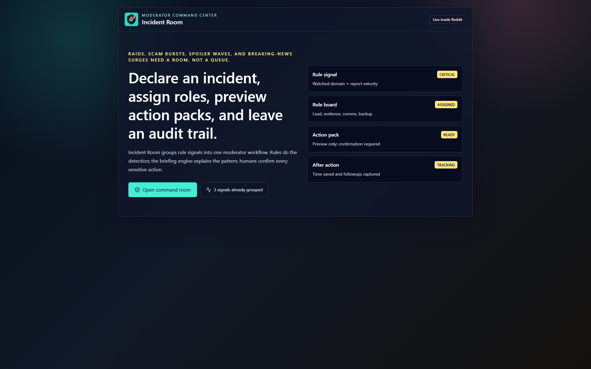
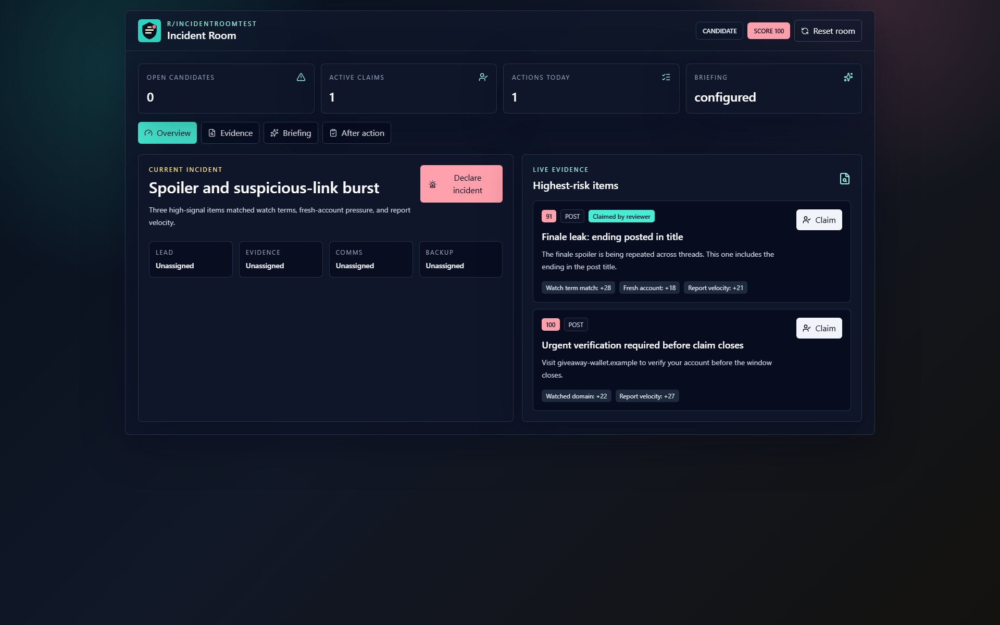
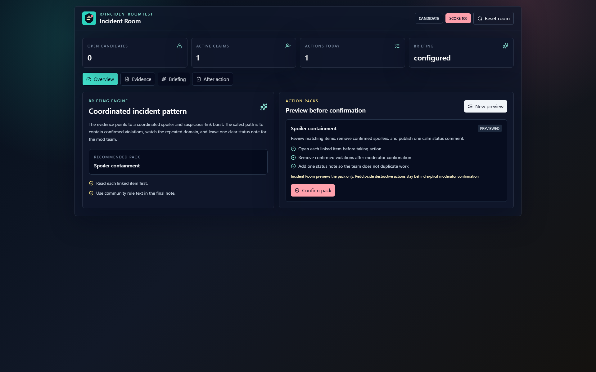
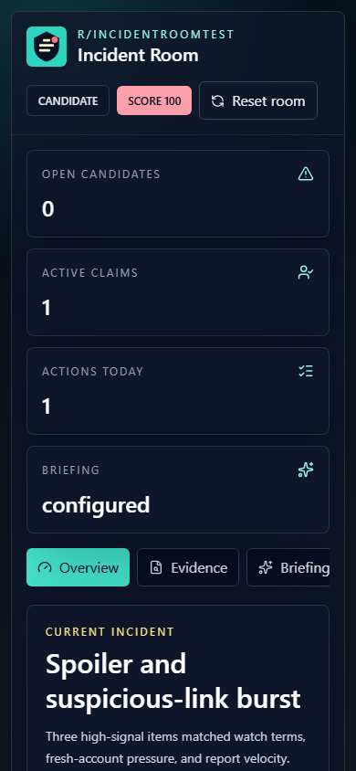
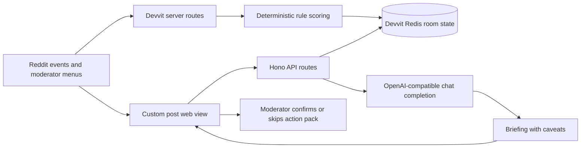

<div align="center">



# Incident Room

### A Devvit command room for Reddit moderators when a live incident starts moving faster than the team thread.

*Incident Room turns reports, posts, comments, moderator actions, rule signals, claims, and a bounded AI briefing into one shared custom post. Moderators keep the final call, but the room stops duplicate review and preserves the reason for every decision.*

[](https://developers.reddit.com/apps/incidentrm260526)
[](https://www.reddit.com/r/incidentrm260526_dev)
[](./LICENSE)

**Quick links:**
[Architecture](./docs/ARCHITECTURE.md) ·
[Deployment](./docs/DEPLOYMENT.md) ·
[Demo video](https://github.com/veithly/incident-room/releases/download/v0.0.3-demo/pitch-demo-combined-final.mp4) ·
[Submission draft](./SUBMISSION.md) ·
[中文](./docs/zh/README.md)

</div>

---

## Why Incident Room matters

Fast subreddit incidents rarely arrive as one clean report. A sports final gets spoiled, a creator AMA is brigaded, or a scam domain spreads through comments while five moderators are checking the same links in different tabs. The hard part is not only deciding what to remove. The hard part is keeping the team aligned while evidence changes minute by minute.

Incident Room gives moderators one live room inside Reddit. It scores evidence with deterministic rules, lets people claim items, records every room event, previews action packs, and asks a real OpenAI-compatible model for a compact briefing only after a moderator declares the incident.

| Dimension | Status quo | Incident Room |
| --- | --- | --- |
| Evidence | Reports, links, and notes split across queues and chats | One Redis-backed room with scored evidence and a timeline |
| Team work | Multiple moderators re-open the same posts | Evidence claims show who is reviewing what |
| AI boundary | Black-box suggestions can outrun policy | AI only summarizes and caveats; moderators confirm every action |
| Handoff | The next shift gets scattered context | After-action metrics and timeline stay in the custom post |

## 30-second demo path

<table>
  <tr>
    <td width="50%"></td>
    <td width="50%"></td>
  </tr>
  <tr>
    <td><b>1.</b> A moderator opens the room from the subreddit menu or the install-created custom post.</td>
    <td><b>2.</b> The dashboard shows the active candidate, evidence scores, claims, and timeline in one place.</td>
  </tr>
  <tr>
    <td width="50%"></td>
    <td width="50%"></td>
  </tr>
  <tr>
    <td><b>3.</b> Declaring the incident requests a live Step AI `step-3.6` briefing through an OpenAI-compatible endpoint.</td>
    <td><b>4.</b> The same flow fits a phone opened from a QR code during review.</td>
  </tr>
</table>

## Quick start

```bash
npm install
cp .env.example .env
npm run verify
```

For a local AI smoke test, set the OpenAI-compatible variables and run:

```bash
$env:OPENAI_API_KEY="<provider-key>"
$env:OPENAI_BASE_URL="https://api.stepfun.com/v1"
$env:OPENAI_DEFAULT_MODEL="step-3.6"
node scripts/smoke-ai.mjs
```

For Devvit playtest:

```bash
npx devvit login
npx devvit settings set openai_api_key
npx devvit settings set openai_base_url https://api.stepfun.com/v1
npx devvit settings set openai_model step-3.6
npm run deploy
npm run dev
```

## How it works



## Built with

| Layer | Choice | Notes |
| --- | --- | --- |
| Reddit platform | Devvit Web `0.12.24` | Custom post, menu items, triggers, scheduler, Redis, Reddit API |
| Frontend | React `19`, Vite `8`, Tailwind `4`, lucide icons | Dense moderation dashboard, desktop and mobile layouts |
| Backend | Hono inside Devvit server | `/api/*`, `/internal/menu/*`, `/internal/triggers/*`, scheduler routes |
| State | Devvit Redis | Room state, evidence, claims, action packs, timeline, metrics |
| Rules | Local TypeScript engine | Watch terms, report velocity, fresh accounts, repeated patterns, watched domains |
| AI | Step AI `step-3.6` through OpenAI-compatible chat completions | Server-side key only; briefing cannot mutate Reddit content |
| Testing | Vitest and Playwright | Rule scoring plus the declare, claim, briefing, confirm, after-action flow |

## Bounty fit

| Track | Fit |
| --- | --- |
| Best New Mod Tool | Built for an everyday moderator emergency: scattered signals during a live incident. |
| Moderator's Choice | The UI is not a bot replacement. It preserves human review, claims, and audit context. |

## Safety boundary

- `openai_api_key` is a Devvit secret setting and is never sent to the browser.
- Local smoke tests use `OPENAI_API_KEY`; the app code keeps the same OpenAI-compatible naming.
- The model only returns `summary`, `likelyPattern`, `recommendedActionPack`, and `moderatorCaveats`.
- Reddit-side destructive actions are not executed by the model.
- Action packs stay in preview/confirm state for moderator review.
- The deterministic rule engine still works when the AI key is missing or the provider fails.

## Repository layout

```text
.
├── devvit.json              Devvit app config, settings, triggers, menus, scheduler
├── src/client/              Custom post React screens
├── src/server/              Hono routes and Devvit server logic
├── src/shared/              State contracts, rule engine, API types, demo fixtures
├── tests/                   Vitest and Playwright coverage
├── scripts/                 Static preview, screenshot capture, live AI smoke test
├── docs/                    Architecture, deployment, screenshots, Chinese mirror
└── pitch/                   Idea, user cases, PRD, submission support
```

## Verification

```bash
npm run verify
npm run test:e2e
node scripts/capture-mockups.mjs
node scripts/smoke-ai.mjs
npm run video:submission
npm run deck:submission
npx devvit settings list
```

The public repository is `incident-room`. The Devvit review app keeps the already-submitted technical slug `incidentrm260526` with playtest subreddit `r/incidentrm260526_dev`. Devvit version `0.0.3` has been submitted for review. The Devpost video renderer writes an under-one-minute `pitch/recording/pitch-demo-combined-final.mp4`; media files are gitignored and can be regenerated with `npm run video:submission`.

## License

BSD-3-Clause. See [LICENSE](./LICENSE).
