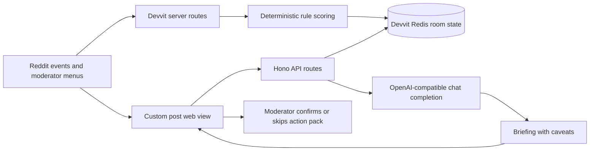

# Incident Room

Incident Room 是一个 Reddit Devvit 版的版主事件指挥室。它把帖子、评论、举报、版主动作、规则信号、证据认领和受约束的 AI briefing 放进同一个 custom post。版主仍然做最终决定，但团队不再重复审核同一批证据，也不会丢掉每次判断的理由。

## 为什么重要

大型社区的突发事件通常不是一个干净的举报单。体育决赛被剧透，创作者 AMA 被冲击，或者诈骗域名在评论区扩散时，版主会同时看队列、聊天、modmail 和多个链接。真正麻烦的不是少点一次按钮，而是在证据快速变化时让团队保持一致。

Incident Room 的目标是把这些分散信号变成一个可协作的 room：规则引擎先打分，版主认领证据，时间线记录每个动作，action pack 只进入预览状态，AI 只在版主声明 incident 后给出简短 briefing 和注意事项。

## 快速开始

```bash
npm install
cp .env.example .env
npm run verify
```

本地 AI smoke test 使用 OpenAI-compatible 变量名：

```bash
$env:OPENAI_API_KEY="<provider-key>"
$env:OPENAI_BASE_URL="https://api.stepfun.com/v1"
$env:OPENAI_DEFAULT_MODEL="step-3.6"
node scripts/smoke-ai.mjs
```

Devvit playtest：

```bash
npx devvit login
npx devvit settings set openai_api_key
npx devvit settings set openai_base_url https://api.stepfun.com/v1
npx devvit settings set openai_model step-3.6
npm run deploy
npm run dev
```

## 工作方式



## 技术栈

| 层 | 选择 | 说明 |
| --- | --- | --- |
| Reddit 平台 | Devvit Web `0.12.24` | Custom post、menu、trigger、scheduler、Redis、Reddit API |
| 前端 | React `19`、Vite `8`、Tailwind `4`、lucide icons | 桌面和移动端 moderation dashboard |
| 后端 | Devvit server 中的 Hono | `/api/*`、`/internal/menu/*`、`/internal/triggers/*` |
| 状态 | Devvit Redis | room state、证据、认领、action pack、timeline、metrics |
| 规则 | TypeScript 本地规则引擎 | watch terms、report velocity、fresh accounts、repeated patterns、watched domains |
| AI | Step AI `step-3.6` through OpenAI-compatible chat completions | server-side key；AI 不直接修改 Reddit 内容 |
| 测试 | Vitest 和 Playwright | 规则评分与核心版主流程 |

## 安全边界

- `openai_api_key` 是 Devvit secret setting，不进入浏览器。
- 本地 smoke test 使用 `OPENAI_API_KEY`，代码保持 OpenAI-compatible 命名。
- 模型只返回 `summary`、`likelyPattern`、`recommendedActionPack`、`moderatorCaveats`。
- 模型不能 remove、lock、ban、approve 或调用 Reddit API。
- action pack 只有在版主确认后才记为 confirmed。
- 如果没有 AI key 或 provider 出错，规则引擎仍然可用。

## 链接

- Devvit app: https://developers.reddit.com/apps/incidentrm260526
- Playtest subreddit: https://www.reddit.com/r/incidentrm260526_dev
- GitHub repo: https://github.com/veithly/incident-room
- Demo video: https://github.com/veithly/incident-room/releases/download/v0.0.3-demo/pitch-demo-combined-final.mp4
- Architecture: [../ARCHITECTURE.md](../ARCHITECTURE.md)
- Deployment: [../DEPLOYMENT.md](../DEPLOYMENT.md)

## 验证与视频

```bash
npm run verify
npm run test:e2e
node scripts/capture-mockups.mjs
node scripts/smoke-ai.mjs
npm run video:submission
```

Devvit version `0.0.3` 已提交 review。Combined pitch/demo 本地渲染输出为 `pitch/recording/pitch-demo-combined-final.mp4`；媒体文件不进 git，可用 `npm run video:submission` 重新生成。

## License

BSD-3-Clause。见 [LICENSE](../../LICENSE)。
